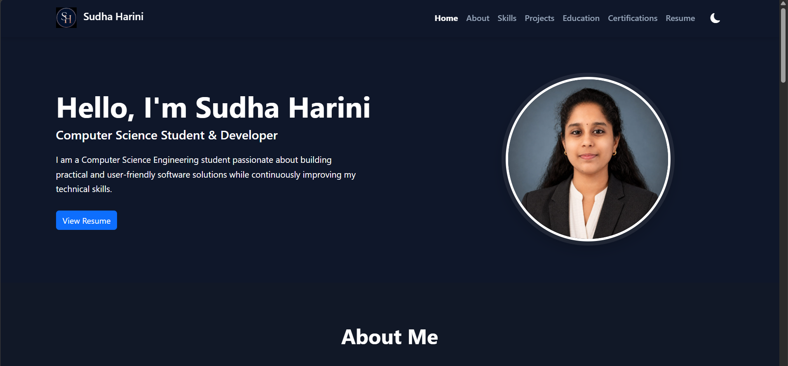
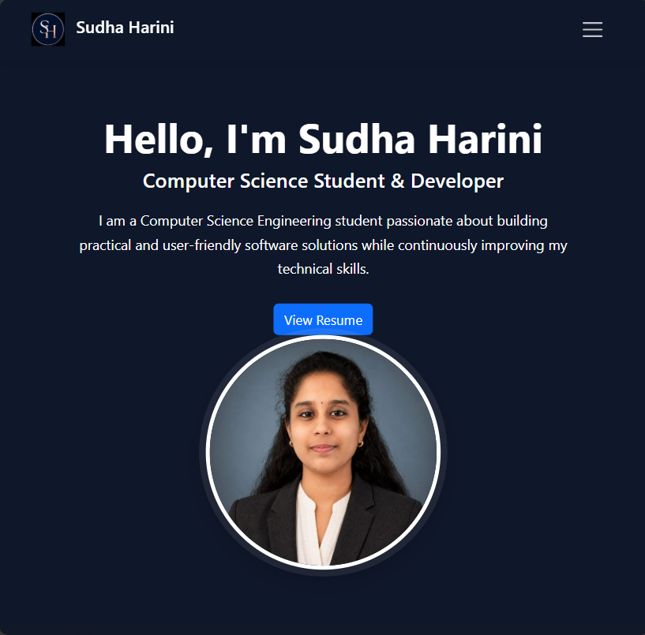

# Developer Portfolio Website

A professional, responsive developer portfolio website built using HTML5, Bootstrap 5, and Vanilla JavaScript.

## Project Overview

This project is a personal developer portfolio designed to showcase my skills, projects, education, certifications, resume, and contact information.

The primary goal of this project is not only to create a professional portfolio but also to gain practical experience in frontend development using HTML5, Bootstrap 5, Vanilla JavaScript, Git, GitHub, browser developer tools, and website deployment.

## Features

* Responsive navigation bar
* Hero section with professional introduction
* About Me section
* Technical skills section
* Project showcase
* Education section
* Certifications section
* Resume preview and download
* Dark/Light theme toggle
* Smooth scrolling
* Active navigation highlighting
* Scroll-to-top button
* Typing animation
* Dynamic copyright year
* Responsive design for mobile, tablet, and desktop

## Technologies Used

* HTML5
* Bootstrap 5
* Vanilla JavaScript
* Bootstrap Icons
* Google Fonts
* Git
* GitHub

## Project Structure

```text
Portfolio/
│
├── README.md
├── .gitignore
├── index.html
├── 404.html
├── robots.txt
│
├── assets/
│   ├── css/
│   │   ├── style.css
│   │   └── responsive.css
│   │
│   ├── js/
│   │   └── script.js
│   │
│   ├── images/
│   │   ├── profile/
│   │   ├── projects/
│   │   ├── certificates/
│   │   └── icons/
│   │
│   ├── documents/
│   │   └── Resume.pdf
│   │
│   └── favicon/
│       └── favicon.ico
│
└── screenshots/
    ├── desktop.png
    ├── tablet.png
    └── mobile.png
```

## Screenshots


### Desktop



### Tablet



### Mobile


## Live Demo

(https://sudhaharini05.github.io/PortfolioSudhaHarini/)

## How to Run

1. Clone the repository.
2. Open the project folder.
3. Open `index.html` in a web browser.

No backend server or package installation is required because this is a static frontend project.

## Future Improvements

* Add additional projects
* Improve accessibility based on Lighthouse audits
* Add additional portfolio sections when required
* Explore advanced frontend performance optimization
* Integrate a real contact-form service if required

## Learning Outcomes

Through this project, I aim to gain practical experience in:

* Semantic HTML5
* Responsive web design
* Bootstrap 5
* Vanilla JavaScript
* DOM manipulation
* Local Storage
* Browser Developer Tools
* Git and GitHub
* Website deployment
* Accessibility
* Basic SEO
* Frontend project organization

## Author

**Harini**

Developer Portfolio Website — built as a practical frontend learning project.